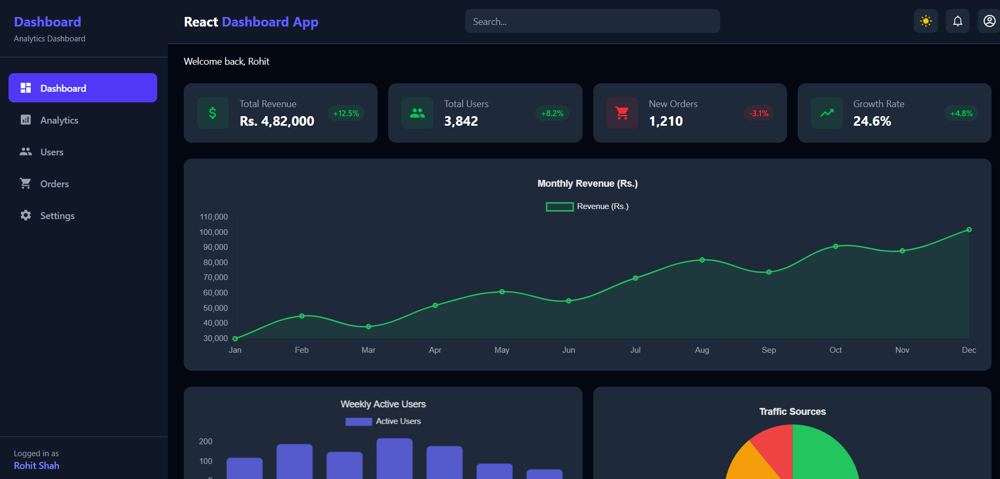

# React Dashboard App

A modern and responsive **React Analytics Dashboard Application** that provides a clean and professional interface for visualizing business metrics, revenue data, and user activity.

This project demonstrates real-world frontend development concepts such as **Chart.js integration, Context API for global theme management, responsive sidebar navigation, dark/light mode, and component-based architecture**, making it a strong portfolio project for aspiring frontend developers.

---

## Live Demo
Check out the live version here:
**(https://rohitshahreactdashboardapp.netlify.app/)**

---

## Preview


---

## Features

- Interactive charts — Line, Bar, and Pie using Chart.js
- Dark and Light mode toggle with localStorage persistence
- Responsive sidebar with mobile hamburger menu
- Stat cards showing key business metrics with positive/negative indicators
- Monthly revenue line chart with smooth curve
- Weekly active users bar chart
- Traffic sources pie chart
- Fully responsive design — mobile, tablet, and desktop
- Clean and professional UI built with Tailwind CSS
- Fast performance with Vite

---

## Tech Stack

- **React JS**
- **Vite**
- **Tailwind CSS**
- **Chart.js**
- **react-chartjs-2**
- **React Router**
- **Context API**
- **JavaScript (ES6+)**
- **Component-Based Architecture**

---

## Key Concepts Demonstrated

- Global state management using **Context API**
- Dark/Light theme with **localStorage** persistence
- Data visualization with **Chart.js** (Line, Bar, Pie)
- Responsive sidebar with mobile toggle using **Tailwind CSS**
- Reusable **StatCard** component with dynamic styling
- Modular chart components with theme-aware options
- Mock data separation into a dedicated data layer
- Responsive grid layouts for different screen sizes

---

## Installation

Clone the repository and install dependencies.

```bash
git clone https://github.com/rohitshah316/React-Dashboard-App.git
cd React-Dashboard-App
npm install
```

## Run Locally

```bash
npm run dev
```